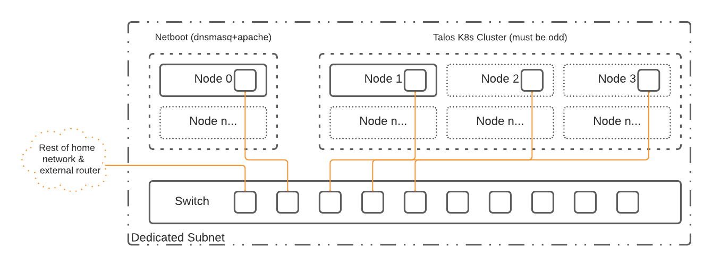

# 30 Minutes to Kubernetes

[Talos](https://www.talos.dev) is a container optimized Linux distro; a reimagining of Linux for distributed systems such as Kubernetes (k8s). Designed to be as minimal as possible while still maintaining practicality. For these reasons, Talos has a number of features unique to it:

- it is immutable
- it is atomic
- it is ephemeral
- it is minimal
- it is secure by default
- it is managed via a single declarative configuration file and gRPC API

Talos can be deployed on container, cloud, virtualized, and bare metal platforms.

The steps below and ```netboot-node.sh``` script will setup *n* number of Raspberry PIs with Talos (and subsequently Kubernetes).

## Configuration Overview



In this setup we use a control node hosting [Dnsmasq](https://thekelleys.org.uk/dnsmasq/doc.html) to provide the TFTP services needed to kickstart (i.e. netboot) the Raspberry PI and get the Talos kernel running on the PI. From there, the Talos kernel will pull down everything it needs based on the configuration files hosted by [Apache](https://httpd.apache.org/). These configuration files are created in the ```netboot-node.sh``` script, using the ```talosctl``` CLI and linked to in the generated ```cmdline.txt```.

A note here on Dnsmasq, we are only using the TFTP portion of Dnsmasq's functionality. Both the DNS server and the DHCP IP allocation functionality are turned off. Feel free to enable them if need be. Also, in this configuration, Dnsmasq can safely coexist with your existing DHCP provider. **Please make sure that the IP set at the top of the script is never allocated by your DHCP provider.**

## Prerequisites

- At least two Raspberry PI 4s, preferably of the 8GB variety. You can use a 4GB but 8GB is strongly preferred. For HA, you will need at least five Raspberry PIs (one netboot and four Talos nodes). The configuration script adjusts according to the number of nodes available.
- DHCP, for IP allocation, should already be setup on the network.

## Installation

### Each Talos Node

You will need to install Raspbian Lite on a SD card and boot each "soon-to-be-Talos" node once and do the following (the same card can be used each time):

| Instruction | Bash Command             |
|:------------|-------------------------:|
|All Raspberry PIs must have netboot enabled with a boot order of network >> SD card >> USB.|```sudo raspi-config```|
|Write down the last 8 digits of each Raspberry PIs serial number. You will typically find it at the bottom.|```cat /proc/cpuinfo```|
|Power down all the nodes and put a blank SD card in each. Complete the Netboot setup using the serial numbers from above.|   |

### Netboot Node

It is highly recommended to use a USB based NVMe drive on the Netboot node. SD cards have a very limited lifetime and the Netboot node will need to keep your configurations safe for a long time. 

| Instruction | Bash Command             |
|:------------|-------------------------:|
|Install 64-bit Raspbian Lite on the USB drive. The easiest method is using [Rasbian's own imager](https://www.raspberrypi.com/news/raspberry-pi-imager-imaging-utility/)|       |
|[Enable SSH](https://www.raspberrypi.com/documentation/computers/remote-access.html#ssh) on that device| ```sudo touch /boot/ssh```|
|Boot up the Pi and SSH into it|   |
|Install git|```sudo apt install git```|
|Clone the repo|```git clone https://github.com/geekdojo-ofc/rpi-talos-netboot.git```|
|CD to the directory|```cd rpi-talos-netboot```|
|Alter the variables at the top to your needs including adding all the serial numbers from the Talos nodes.|```nano netboot-node.sh```|
|Chmod the script|```chmod +x netboot-node.sh```|
|Switch to root|```sudo su```|
|Run the script|```./netboot-node.sh```|
|Exit root|```exit```|
|If everything looks good with no errors then enable Dnsmasq|```sudo systemctl enable dnsmasq.service```|
|Now start the Talos nodes| |

Assuming everything is working correctly you should see all the nodes come online, pull down the TFTP boot, reboot, then begin the Talos configuration. Be aware that it can take *several* minutes for Talos to fully boot, configure, and come online. You can view the TFTP traffic on the netboot node using ```tail -f /var/log/daemon.log```.

The Talos config file is located in ```/var/www/html/talosbaseline/talosconfig``` (a future version of the script will move this to a better location). You will need it for all Talos commands and can start with [verifying the Talos setup following their instructions](https://www.talos.dev/docs/v0.14/introduction/getting-started/#kubernetes-bootstrap).

Good luck and if you have any issues with the script you can [log them against this repo](https://github.com/geekdojo-ofc/rpi-talos-netboot/issues). Likewise, if you want to improve the script, feel free to issue pull requests against the repository.
